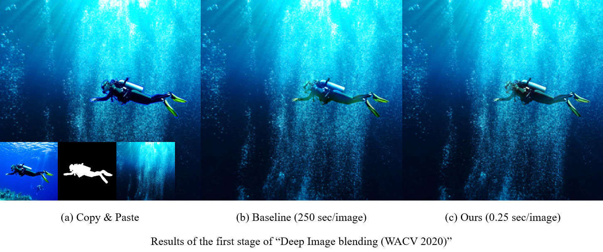
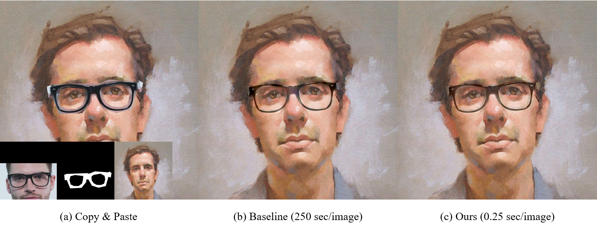
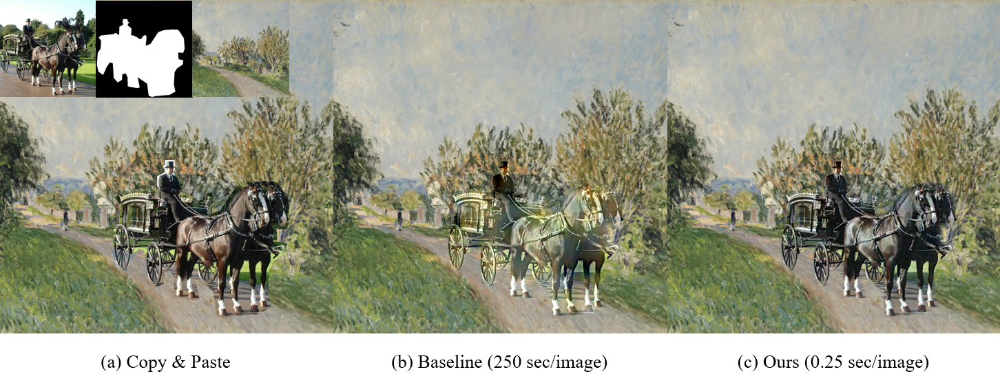
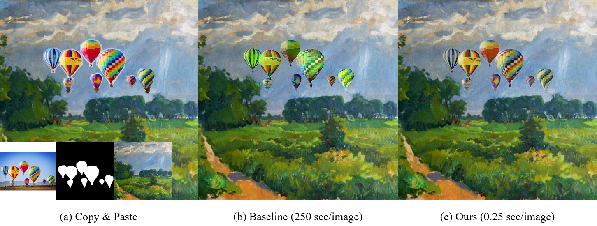

# Fast Deep Image Blending
We improves the image blending method [Deep Image Blending](http://openaccess.thecvf.com/content_WACV_2020/papers/Zhang_Deep_Image_Blending_WACV_2020_paper.pdf) by boosting up speed of the first stage of it's process at least 1000x. 
Our code is based on their [repository](https://github.com/owenzlz/DeepImageBlending).

## Results

## Training
### Quick start
`python3 train.py --trainset=path/to/trainset`
### Setting hyperparameters
`python train.py --grad_weight=1e3 --style_weight=1e2 --content_weight=1e0`
### Resuming
`python train.py --grad_weight=1e3 --style_weight=1e2 --content_weight=1e0 --resume=./results/mydir/snapshots/mysnapshot.pt --optim=results/mydir/snapshots/mysnapshot_optim.pt`

## Test
`python inference.py --device=0 --preset=0 --snapshot=./pretrained/data0_10.pt`

`python inference.py --snapshot=./results/mydir/snapshots/mysnapshot.pt --source_file=data/0_source.png --mask_file=data/0_mask.png --target_file=data/0_target.png --x=240 --y=350`

### Traditional method
`python traiditional.py --preset=0`

## Dataset
We used [MSRA10K](https://mmcheng.net/msra10k/) and [MSRA-B](https://mmcheng.net/msra10k/), total 15K pairs of (object image, binary mask).

## Pretrained model
In `./pretrained`, we provide pretrained models for images of `./data`.